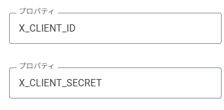

# About

A bot that tweets when a code is generated.

# Useage

1. Copy and paste from `index.js` into GoogleAppScript.
1. Configure `X_CLIENT_ID` and `X_CLIENT_SECRET` from X API.

    (Example)

    
1. Execute `authorizationSetting` then open the link below.

    (If it succeeds, “success” will be displayed.)

1. When you execute `doTweet`, a gift code will be tweeted only if a new gift code is available.

# Note

If you find any issues or have suggestions for improvements, please submit an issue or a pull request.